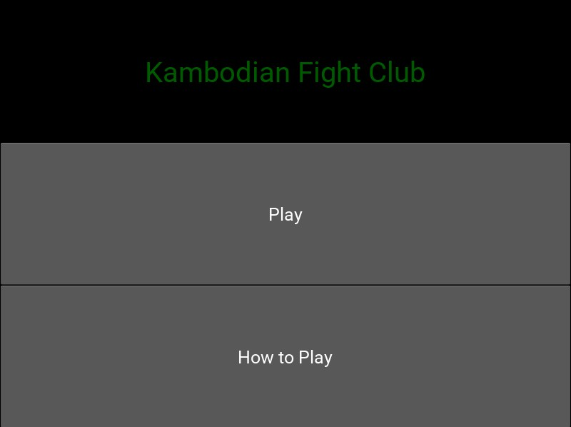
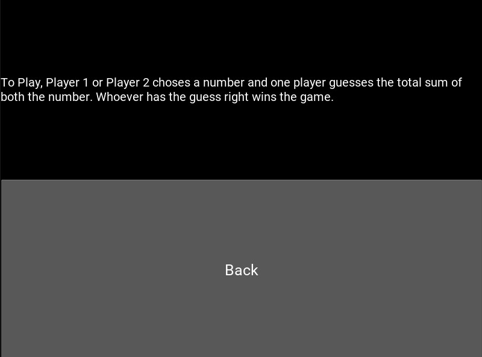
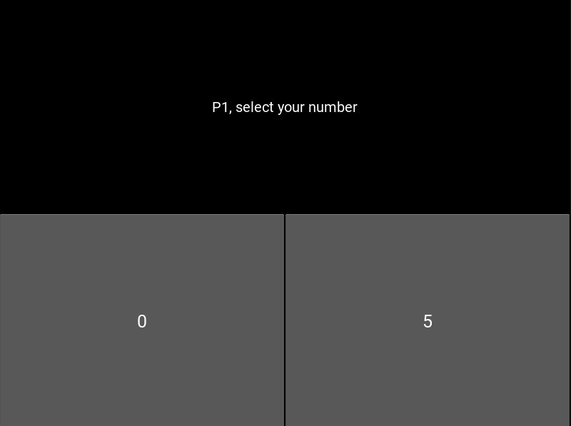
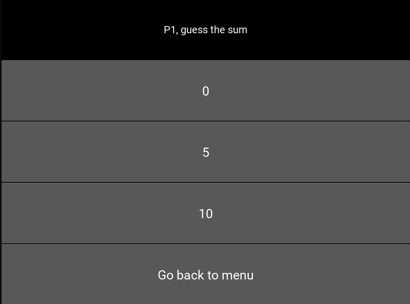
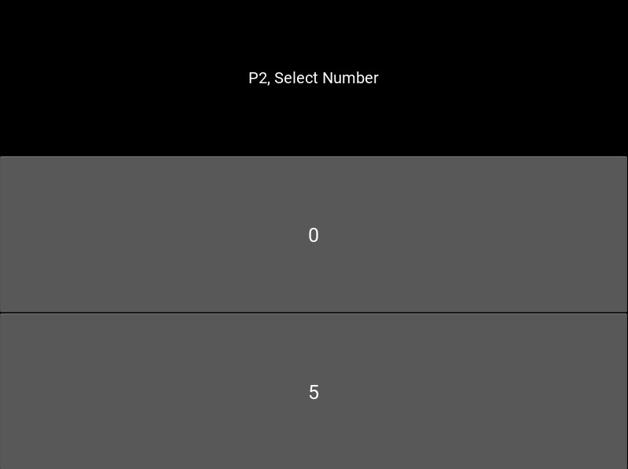
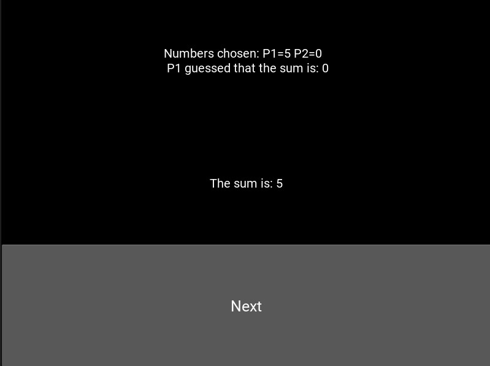

# Code With Friends Fall 2020 Submission
Author: [Henry Nguyen](https://github.com/hnguye24), [Ankit Singh](https://github.com/ankit171)

Source Code: https://github.com/hnguye24/Kambodian-Fight-Club 

## Kambodian-Fight-Club
Our friend showed us an in-person hand game [(sort of like chopsticks)](https://en.wikipedia.org/wiki/Chopsticks_(hand_game)) and called it "Kambodian Fight Club". It was a catchy and simple game, so we decided to recreate a simplified version.

### How the Game Works
* Each player chooses either 0 or 5 in their mind
* The goal of the game is to guess the sum of both players' selected number (0, 5, or 10)
* If player 1 guesses the correct sum, player 1 wins; otherwise, player 2 will guess the sum next
* The game continues until one player guesses the correct sum

### Technologies used
* Python
* Kivy

### What we learned
* Finding youtube videos about the topic you are trying to learn
* Debugging issues by identifying the problem and using google/stackover flow
* Making a plan, drawing diagrams, and executing on our plan
* Learning how to design a simple GUI
* Working in a team and using GitHub to combine our work

#### Screenshots

